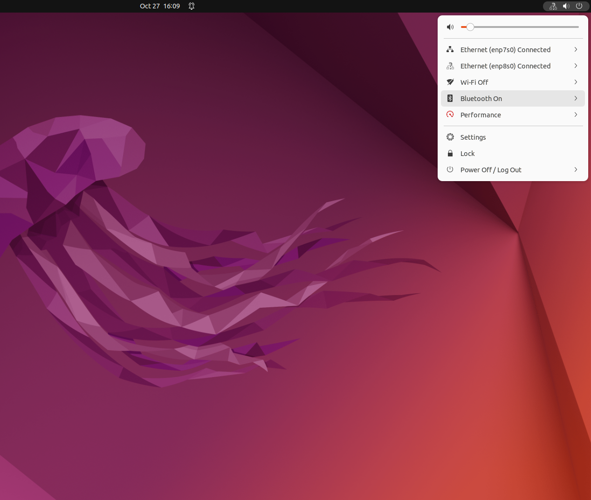
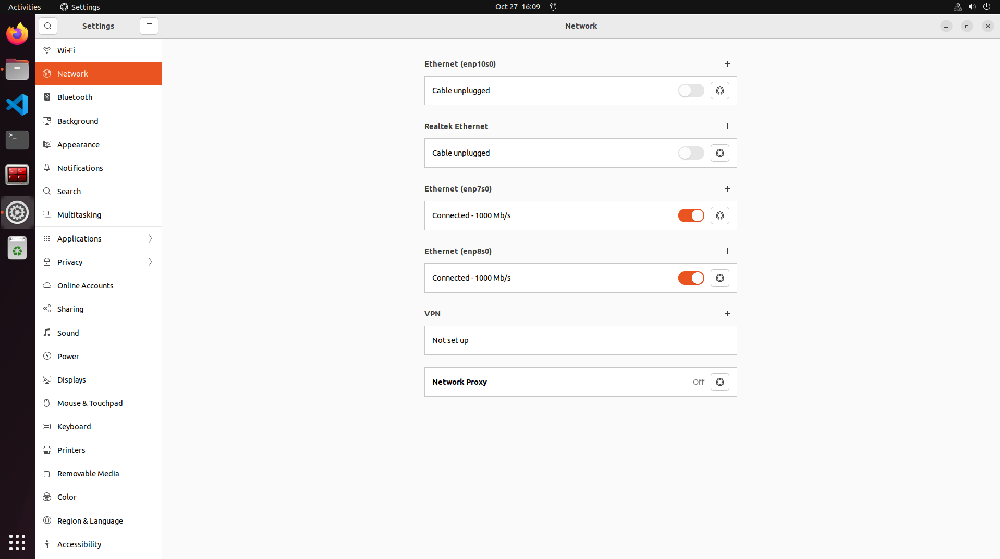

# Inter-Device Communication at Scale in ROS 2 Using Wi-Fi

## Problem
When deploying multiple robots (for example, Raspberry Pi-based systems) running ROS 2 over Wi-Fi, communication reliability quickly becomes a bottleneck. While small setups with up to 10–12 devices typically work without major issues, larger networks often suffer from unstable connections, discovery failures, or dropped messages.</br>
This guide presents a practical approach to enabling reliable inter-device communication at scale in ROS 2 using standard Wi-Fi networks.

## What you need

1. A Ubuntu PC with multiple Ethernet ports that support simultaneous connections to multiple networks.
    - A PC equipped with an additional network card (installed in a PCI-Express slot) usually allows connections to multiple networks at the same time.

2. Multiple Wi-Fi routers.
    - As a rule of thumb, plan for roughly 10 devices per router. For example, if you want to connect 20 devices, you’ll need 2 routers.

3. Ethernet cables to connect each router to the PC.

## Setup


To illustrate the process, let’s consider a setup with 20 robots. Since a single Wi-Fi network can reliably handle around 10 devices, we’ll use two routers to distribute the load — 10 robots connected to each router.

In this guide, I’ll walk you through a simplified example with two devices, one connected to **Router 1** and the other to **Router 2**. You’ll learn how to configure the network, verify connectivity, and enable ROS 2 communication between them.

Once you understand this two-device setup, you can scale it up easily — the same configuration steps apply to larger systems (e.g., 10 devices per router or more).

### Router and PC Setup
Start by configuring both routers that will form the backbone of your network setup. Each router will manage a separate subnet to ensure stable communication when scaling to multiple devices.

1. Configure **Router 1** and **Router 2**
    - Access the admin page of each router using a web browser.

    - Set the SSID and password for each router. You can choose any names and credentials you prefer.

    - In the router settings, locate the option to change the router’s IP address or LAN network configuration (usually under ```Network Setings -> LAN```).

2. Assign different subnets to the routers
    - To allow your Ubuntu PC to route traffic correctly between the two networks, assign distinct Layer-3 subnets, eg.:

    1. ```Router 1```: LAN IP Address: 192.168.3.1

    2. ```Router 2```: LAN IP Address: 192.168.4.1

3. Connect the routers to the Ubuntu PC

    - Use Ethernet cables to connect each router to a different Ethernet port on your Ubuntu PC.

    - After connection, the PC should detect both networks as separate wired interfaces (for example, enp7s0 and enp8s0).

Once you have sucessfully connected the two routers, they would look like this:



4. Run ```ifconfig``` in the terminal and note down the IP address of the Ubuntu PC on both the networks. The output might look like this:
```bash
enp7s0: flags=4163<UP,BROADCAST,RUNNING,MULTICAST>  mtu 1500
        inet 192.168.4.5  netmask 255.255.255.0  broadcast 192.168.4.255
        inet6 fe80::690a:df31:1823:5bf9  prefixlen 64  scopeid 0x20<link>
        ether 00:30:64:46:f1:b8  txqueuelen 1000  (Ethernet)
        RX packets 1801  bytes 1279991 (1.2 MB)
        RX errors 0  dropped 156  overruns 0  frame 0
        TX packets 1747  bytes 297077 (297.0 KB)
        TX errors 0  dropped 0 overruns 0  carrier 0  collisions 0
        device interrupt 37  memory 0xf64c0000-f64e0000  

enp8s0: flags=4163<UP,BROADCAST,RUNNING,MULTICAST>  mtu 1500
        inet 192.168.3.8  netmask 255.255.255.0  broadcast 192.168.3.255
        inet6 fe80::8ea7:5f53:f687:4ce6  prefixlen 64  scopeid 0x20<link>
        ether 00:30:64:46:f1:b9  txqueuelen 1000  (Ethernet)
        RX packets 469  bytes 72335 (72.3 KB)
        RX errors 0  dropped 157  overruns 0  frame 0
        TX packets 873  bytes 87574 (87.5 KB)
        TX errors 0  dropped 0 overruns 0  carrier 0  collisions 0
        device interrupt 37  memory 0xf63c0000-f63e0000 
        
```

- Hence the Ubuntu PC has:
    1. **Router 1** IP Address: ```192.168.4.5```
    2. **Router 2** IP Address: ```192.168.3.8```

5. To allow the PC to forward packets from one network to the other, run the following command in the terminal:
```bash
sudo sysctl -w net.ipv4.ip_forward=1
```
(You need to run this command after every restart, alternatively you can also set it up to automically by creating a service and enabling it via systemctl command)

#### Start a Fast DDS Discovery Server

(Assuming ROS 2 is already installed on the Ubuntu PC.)

1. On the Ubuntu PC, create a new file named ```setup-ros2-discovery.sh```: 
    ```bash
    touch setup-ros2-discovery.sh
    ```
2. Open the file and paste the following lines:
    ```bash
    export RMW_IMPLEMENTATION=rmw_fastrtps_cpp
    export ROS_DISCOVERY_SERVER=127.0.0.1:11811
    export ROS_SUPER_CLIENT=True
    ```
    Save and close the file.
3. Source this file in your terminal, this ensures the environment variables are active in your terminal:
    ```bash
    source setup-ros2-discovery.sh
    ```
4. In the same terminal, start the Fast DDS server using the following command:
    ```bash
    fastdds discovery --server-id 0
    ```

**Note**: 
Before starting any ROS 2 nodes (publishers, subscribers, or service clients), ensure that the same setup file is **sourced in every terminal**. This allows all nodes to use the discovery server for participant registration and topic discovery.

### Robot setup

*(While this guide is written in the context of robotics, the same procedure applies to any devices that need ROS 2 communication across separate networks.)*

**Note**: In this guide, the term Robot refers to a single-board computer (SBC), such as a Raspberry Pi, typically mounted on and controlling a robot platform.

To demonstrate the setup, we’ll use two robots:
 - **Robot 1** connected to **Router 1**
 - **Robot 2** connected to **Router 2**

Example IP configuration:
- Robot 1: 192.168.4.10
- Robot 2: 192.168.3.10

1. **Add IP routes.** Each robot needs to know how to reach the subnet of the other router through the Ubuntu PC acting as a gateway.
    - On Robot 1, run the command:
        ```bash
        sudo ip route add 192.168.3.0/24 via 192.168.4.5
        ```
    - On Robot 2, run the command:
        ```bash
        sudo ip route add 192.168.4.0/24 via 192.168.3.8
        ```
    Here, the Ubuntu PC has IP addresses 192.168.4.5 and 192.168.3.8 on its respective Ethernet interfaces.
    These commands tell:

    - Robot 1 (on subnet 4) how to reach subnet 3 via the Ubuntu PC

    - Robot 2 (on subnet 3) how to reach subnet 4 via the Ubuntu PC

    You can verify if the path was added by running the command:
    ```bash
    ip route
    ```
    **Note**: These routes will not persist after a reboot. You’ll need to reapply them after each restart, or add them permanently via your network configuration files or systemd services.
    
    *At this point you should be able to ping Robot 1 from Robot 2 and vice versa.*

2. On both the Robots, create the ROS 2 Discovery Setup File:
    ```bash
    touch setup-ros2-discovery.sh
    ```
3. The contents of this file will differ between robots
    - On Robot 1 (as it is on subnet 4):
    ```bash
    export RMW_IMPLEMENTATION=rmw_fastrtps_cpp
    export ROS_DISCOVERY_SERVER=192.168.4.5:11811
    export ROS_SUPER_CLIENT=True
    ```
    - On Robot 2 (as it is on subnet 3):
    ```bash
    export RMW_IMPLEMENTATION=rmw_fastrtps_cpp
    export ROS_DISCOVERY_SERVER=192.168.3.8:11811
    export ROS_SUPER_CLIENT=True
    ```

4. On each robot, source the respective setup file before running any ROS 2 nodes::
    ```bash
    source setup-ros2-discovery.sh
    ```

Once sourced, ROS 2 nodes running on different subnets should be able to discover each other. You can verify this using:
```bash
ros2 topic list
```

**Important:**

    Always source the respective setup file before launching publishers, subscribers, or services. Both the publishing and subscribing devices must source the respective setup file for topics and services to be visible across networks.

**The IP addresses shown in this tutorial are just examples — make sure to use the ones that match your own network configuration.**


